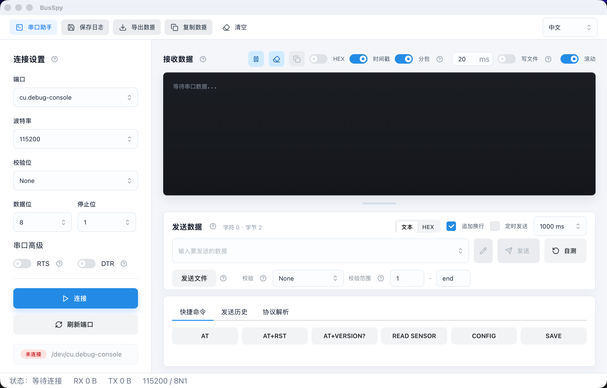

<p align="center">
  
</p>

<h1 align="center">BusSpy</h1>

<p align="center">
  串口 / TCP / UDP 调试助手，支持 HEX 收发、协议帧查看、发送历史和常用指令标签。
</p>

<p align="center">
  
</p>

BusSpy 是一个基于 Tauri + React 的串口/网络调试助手，面向串口设备、TCP/UDP 调试、HEX 收发、协议帧观察和常用发送内容管理。

## 当前功能

- 连接方式：串口、TCPClient、TCPServer、UDP
- 接收数据：文本/HEX 显示、时间戳、分包显示、自动滚动、复制、清空
- 发送数据：文本/HEX 发送、追加换行、定时发送、文件载入、发送历史、标签命名
- 校验追加：None、SUM、XOR、CRC8、CRC16、Modbus CRC16
- 协议解析：接收帧/发送帧切换、字节视图、字段视图
- 数据导出：保存日志、导出结构化 JSON
- 设置持久化：语言、发送历史、发送标签使用 SQLite 保存

## 平台支持

BusSpy 目标支持：

- macOS
- Windows
- Linux

不同系统的串口名称不同：

```text
macOS: /dev/cu.usbserial-xxx
Windows: COM3、COM4
Linux: /dev/ttyUSB0、/dev/ttyS0
```

Linux 下如果无法打开串口，通常需要把当前用户加入 `dialout` 组，或调整串口设备权限。

## 下载安装

正式发布建议通过 GitHub Releases 提供安装包：

- Windows：推荐 `.msi`，也可以提供 `.exe` 或 `.zip` 免安装包。
- macOS：推荐 `.dmg`，也可以提供 `.app.zip`。
- Linux：推荐 `.AppImage`，也可以提供 `.deb` / `.rpm`。

如果不购买代码签名证书，也可以正常分发，只是首次运行时系统可能会提示未知开发者或未知发布者。

Windows 首次运行：

- 如果 SmartScreen 提示“Windows 已保护你的电脑”，点击“更多信息”，再点击“仍要运行”。
- 如果公司电脑有安全策略限制，可能需要管理员允许。

macOS 首次运行：

- 如果提示无法验证开发者，可以右键 BusSpy，选择“打开”，再确认打开。
- 也可以到“系统设置 -> 隐私与安全性”中允许 BusSpy 运行。
- 如果仍然无法打开，可以在终端执行：

```bash
xattr -dr com.apple.quarantine /Applications/BusSpy.app
xattr -cr /Applications/BusSpy.app
```

Linux 首次运行：

```bash
chmod +x BusSpy.AppImage
./BusSpy.AppImage
```

Linux 串口权限：

```bash
sudo usermod -aG dialout $USER
```

执行后需要重新登录系统。

命令行安装示例见 [docs/usage.md](docs/usage.md)。

## 使用方法

### 1. 选择连接方式

打开 BusSpy 后，在左侧 `连接设置` 里选择 `端口`：

- 真实串口设备：例如 `COM3`、`cu.usbserial-310`、`ttyUSB0`
- `TCPClient`：作为 TCP 客户端连接远端服务
- `TCPServer`：作为 TCP 服务端监听本地端口
- `UDP`：使用 UDP 收发数据

选择真实串口时，需要设置波特率、校验位、数据位、停止位，常见配置是 `115200 / 8N1`。

### 2. 连接设备

配置完成后点击左侧 `连接`。

- 连接成功后，接收区会显示串口或网络返回的数据。
- 如果连接失败，优先检查端口是否被其他软件占用。
- Linux 下如果提示没有权限，参考下方 `权限说明`。

### 3. 接收数据

接收区支持：

- `HEX`：切换 HEX 显示
- `时间戳`：显示每条数据的接收时间
- `分包`：按时间间隔把连续字节归为一帧
- `滚动`：自动滚动到最新数据
- `复制数据`：复制当前接收日志
- `清空`：清空当前日志

### 4. 发送数据

发送区支持 `文本` 和 `HEX` 两种模式。

文本模式示例：

```text
AT+VERSION?
```

HEX 模式示例：

```text
23 01 1D 04 01 09
```

常用操作：

- `追加换行`：文本模式下发送时追加换行
- `定时发送`：按指定间隔重复发送
- `发送文件`：把文件内容载入输入框后再发送
- 编辑图标：给当前发送内容保存标签，之后可通过标签快速选择

### 5. 协议解析

下方 `协议解析` 可以查看当前帧的字节结构。

- `接收帧`：解析最近一条接收数据
- `发送帧`：解析当前发送输入框内容
- `字节视图`：横向查看每个字节的位置和值
- `字段视图`：按表格查看字节、含义和偏移

适合用来快速查看地址、功能码、起始位、数量、数据区和校验位。

### 6. 保存与导出

顶部工具栏提供：

- `保存日志`：保存当前接收日志
- `导出数据`：导出结构化 JSON 数据
- `复制数据`：复制当前日志
- `清空`：清空接收内容和统计
- 语言切换：中文 / English

## 权限说明

自动发现端口通常不需要额外权限，但打开串口通信可能受系统权限限制：

- macOS：通常可直接使用 USB 串口；首次运行打包应用时可能需要在系统安全设置中允许应用运行。
- Windows：通常可直接访问 `COM` 口；如果端口被其他软件占用，需要先关闭占用程序。
- Linux：常见情况是用户没有 `/dev/ttyUSB0`、`/dev/ttyS0` 等设备权限，需要加入 `dialout` 组。

Linux 权限示例：

```bash
sudo usermod -aG dialout $USER
```

执行后需要重新登录系统。

## 开发命令

```bash
pnpm install
pnpm typecheck
pnpm --filter @busspy/desktop build
pnpm tauri:dev
```

## 自动打包发布

项目已经配置 GitHub Actions 自动打包。推送版本 tag 后，会自动构建并上传 Release 草稿：

- Windows：`.exe` / `.msi`
- macOS：`.dmg`
- Linux：`.AppImage` / `.deb` / `.rpm`

版本号来自：

- `apps/desktop/package.json`
- `apps/desktop/src-tauri/tauri.conf.json`
- `apps/desktop/src-tauri/Cargo.toml`

发布前需要保持三个文件里的版本号一致。

发布 `v0.1.0` 示例：

```bash
git tag v0.1.0
git push origin v0.1.0
```

打包完成后，到 GitHub Releases 检查草稿，确认安装包无误后手动发布。

安装包文件名会带版本号，例如：

```text
BusSpy-0.1.0-windows-x86_64-nsis-setup.exe
BusSpy-0.1.0-windows-x86_64-msi.msi
BusSpy-0.1.0-macos-aarch64-dmg.dmg
BusSpy-0.1.0-linux-x86_64-deb.deb
```

## 使用文档

详细使用说明见：

- [docs/usage.md](docs/usage.md)

## 验证命令

```bash
pnpm typecheck
pnpm --filter @busspy/desktop build
cd apps/desktop/src-tauri
cargo check
cargo test
```
